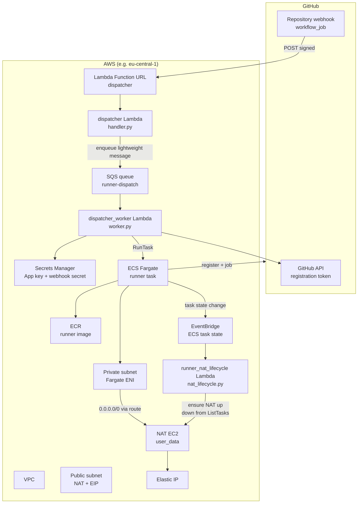

# Self-hosted GitHub Actions runners (Fargate + Lambda): architecture and flow

This document describes **how the on-demand runner stack works end-to-end**: from a GitHub `workflow_job` event to an ephemeral ECS task and back to idle infrastructure. Terraform that provisions it lives under [`terraform/`](../terraform/); operational steps are in [`terraform/README.md`](../terraform/README.md).

---

## Goals

- Run CI jobs on **self-hosted** labels (`runs-on: [self-hosted, fargate]`) instead of GitHub-hosted runners.
- **Spin up only when needed** — no always-on runner VMs.
- Give outbound traffic a **stable public IPv4** (Elastic IP on a NAT EC2 instance) so allowlists and regional behaviour (e.g. EU) are predictable.
- **Avoid Google IP bans in E2E tests** — GitHub-hosted runner IP ranges are on Google's blocklist; the test Google account gets challenged or banned when CI runs from those IPs. A fixed Elastic IP is treated as a known stable origin and keeps the E2E session valid.
- **Stop paying for NAT compute when nothing runs** — the NAT instance is **stopped when there are no runner tasks**, not left running 24/7.

---

## High-level architecture

---

## Components

| Piece                                                                 | Role                                                                                                                                                                                                                                                                                                                                                                                                                         |
| --------------------------------------------------------------------- | ---------------------------------------------------------------------------------------------------------------------------------------------------------------------------------------------------------------------------------------------------------------------------------------------------------------------------------------------------------------------------------------------------------------------------- |
| **GitHub App**                                                        | Installed on the repo; used to mint **installation access tokens** so the dispatcher can call `POST .../actions/runners/registration-token` without a long-lived PAT.                                                                                                                                                                                                                                                        |
| **Repository webhook**                                                | Sends **`workflow_job`** JSON to the dispatcher **Lambda Function URL** (`Content-Type: application/json`). Payload is verified with **`X-Hub-Signature-256`** using the webhook secret in Secrets Manager.                                                                                                                                                                                                                  |
| **dispatcher Lambda** (`terraform/lambda/handler.py`)                 | Fast webhook edge: validates method/signature, filters `action=queued` and **runner labels**, then enqueues a compact dispatch message to SQS and immediately returns `202` (keeps GitHub webhook delivery under timeout budget).                                                                                                                                                                                            |
| **SQS queue** (`runner-dispatch`)                                     | Buffer/decoupling between webhook ingestion and heavy provisioning. Stores one message per queued runner job request.                                                                                                                                                                                                                                                                                                        |
| **dispatcher_worker Lambda** (`terraform/lambda/worker.py`)           | Heavy path: reads SQS message, loads GitHub App key from Secrets Manager, gets registration token, then calls **`ecs:RunTask`** for the runner container. **NAT** is warmed/started by **`runner_nat_lifecycle`** on ECS events (see below), not in the worker.                                                                                                                                                              |
| **ECS cluster + Fargate task definition**                             | One task = one ephemeral **GitHub Actions runner** (container from **ECR**). Task runs in the **private subnet** with **`assignPublicIp=DISABLED`**.                                                                                                                                                                                                                                                                         |
| **Runner container** (`terraform/runner/`)                            | Official **actions/runner** tarball + Playwright-friendly base image; **`EPHEMERAL=1`** so the runner deregisters when the job finishes.                                                                                                                                                                                                                                                                                     |
| **VPC**                                                               | **Public** subnet: internet gateway + **NAT instance** + **Elastic IP**. **Private** subnet: Fargate tasks; default route **`0.0.0.0/0`** targets the **NAT instance’s primary ENI** (not a managed NAT Gateway).                                                                                                                                                                                                            |
| **NAT EC2**                                                           | Small instance in the public subnet with **`nat-user-data.sh`** (iptables MASQUERADE, `ip_forward`, **source/dest check disabled**). Provides SNAT for private workloads. **Can be stopped** when idle to save cost.                                                                                                                                                                                                         |
| **runner_nat_lifecycle Lambda** (`terraform/lambda/nat_lifecycle.py`) | Invoked by **EventBridge** on **ECS Task State Change** for this cluster when `lastStatus` is one of **`STOPPED`**, **`PENDING`**, **`PROVISIONING`**, **`ACTIVATING`**, **`RUNNING`**. Calls **`ecs:ListTasks`** (`RUNNING` / `PENDING`); if **any** task exists, **starts** NAT (if `stopping`, waits **`instance_stopped`** first, then **`StartInstances`** + **`instance_running`**); if **none**, **`StopInstances`**. |

---

## End-to-end flow (happy path)

1. **Developer** opens or updates a PR / push; a workflow with `runs-on: [self-hosted, fargate]` is queued.
2. **GitHub** emits a **`workflow_job`** webhook (`action: queued`) to the **Lambda Function URL**.
3. **dispatcher Lambda**:
   - Rejects non-`POST` or bad **HMAC** signature.
   - Ignores non-`queued` actions or jobs whose labels do not match **`RUNNER_LABELS`** (e.g. `self-hosted`, `fargate`).
   - Enqueues one message to **SQS** and returns **`202 accepted`** quickly.
4. **dispatcher_worker Lambda** is invoked from SQS (`batch_size=1`):
   - Loads **GitHub App** key from **Secrets Manager**, builds JWT, exchanges for an **installation token**, requests a **runner registration token** for the repo.
   - **`RunTask`**: Fargate task in the **private subnet**, env vars **`REPO_URL`**, **`RUNNER_NAME`**, **`RUNNER_TOKEN`**, **`LABELS`**, etc.
5. **Fargate** resolves image pull and log bootstrap via standard AWS service paths through NAT.
6. **Runner** starts, registers with GitHub using the **ephemeral** token, picks up the **queued job**, runs steps (checkout, npm, Playwright, ...).
7. When the job completes, the **runner process exits**; the task moves to **STOPPED** (and earlier transitions emit **`PENDING` / `PROVISIONING` / …** as Fargate schedules work).
8. **EventBridge rule** matches those **ECS Task State Change** events for this cluster and invokes **`runner_nat_lifecycle`**.
9. **`runner_nat_lifecycle`** lists **`RUNNING`** and **`PENDING`** tasks: if **any** exist, it **ensures NAT is running** (same `stopping` → wait stopped → **start** → wait running flow as before); if **none**, it **stops** the NAT EC2.
10. Next job repeats from step 2; the **lifecycle** Lambda starts NAT again when the new task appears in ECS (usually right after **`RunTask`**).

---

## NAT instance and “stop on inactivity”

- **Why a custom NAT EC2 (not AWS NAT Gateway)?**  
  Managed NAT Gateway is simpler but billed hourly + per-GB; a **small NAT instance + one Elastic IP** is often cheaper for **low, bursty** CI traffic, and you still get a **fixed outbound IP** for the repo’s allowlists.

- **How NAT is configured**  
  Terraform launches the NAT AMI from **`data.aws_ami.nat`** with **`nat-user-data.sh`**: install **`iptables-services`** (or **`yum`** equivalent on AL2), enable **`net.ipv4.ip_forward`**, **`MASQUERADE`** on the default interface, **`iptables -F FORWARD`**, save rules. The instance sits in the **public** subnet with an **EIP**; the **private route table** sends default traffic to the NAT instance’s **ENI**.

- **When NAT stops**  
  Only when **`ListTasks`** shows **zero** `RUNNING` and **zero** `PENDING` tasks. Task lifecycle events trigger **`runner_nat_lifecycle`**, which re-checks the cluster; if another job already started a task, NAT stays up.

- **Cold start**  
  If NAT was stopped, **`runner_nat_lifecycle`** starts it when ECS shows a new **`PENDING`/`RUNNING`/…** task for the cluster. That usually happens **right after** **`RunTask`**; there can be a short race before NAT is fully **running** while Fargate pulls the image—same class of risk as any async warm-up. The lifecycle Lambda timeout is generous (**10 minutes**) to allow **`stopping` → `stopped` → start → running`**.

---

## Security and operations notes

- **Function URL** is unauthenticated at the edge; **rely on HMAC** (`GITHUB_WEBHOOK_SECRET`) and keep the secret rotated if leaked.
- **GitHub App** must have permissions sufficient for **runner registration** (see [`terraform/README.md`](../terraform/README.md) — **Administration: Read and write** on the repo for repository-scoped runners).
- **IAM**: shared **dispatcher/worker** role covers SQS, **ECS RunTask**, **PassRole**, **Secrets Manager**, logs — **no EC2** on the worker. **`runner_nat_lifecycle`** uses a **separate** role with **`ecs:ListTasks`** (cluster-scoped) plus **EC2** describe/start/stop for the NAT instance only.
- **Outputs**: `lambda_function_url`, `runner_nat_eip`, ECR URL, cluster name — use these when wiring GitHub and local `docker push`.

---

## Repo map

| Path                                            | Purpose                                                              |
| ----------------------------------------------- | -------------------------------------------------------------------- |
| `terraform/main.tf`                             | VPC, subnets, NAT instance, EIP, ECS, SQS, Lambdas, EventBridge, IAM |
| `terraform/lambda/handler.py`                   | Fast webhook dispatcher (validate + enqueue)                         |
| `terraform/lambda/worker.py`                    | SQS worker (token mint + ECS RunTask)                                |
| `terraform/lambda/nat_lifecycle.py`             | Event-driven NAT start/stop vs runner ECS workload                   |
| `terraform/nat-user-data.sh`                    | NAT bootstrap (loaded via `file()`, not heredoc)                     |
| `terraform/runner/Dockerfile` + `entrypoint.sh` | Runner image                                                         |
| `.github/workflows/build.yml`                   | Example consumer: `runs-on: [self-hosted, fargate]`                  |

For deploy commands, secrets, and GitHub App setup, use **[`terraform/README.md`](../terraform/README.md)**.
