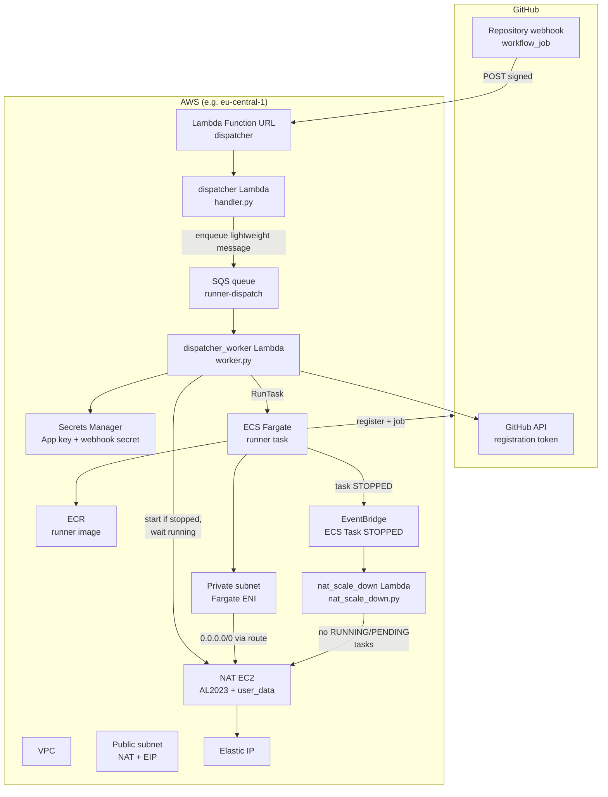

# Self-hosted GitHub Actions runners (Fargate + Lambda): architecture and flow

This document describes **how the on-demand runner stack works end-to-end**: from a GitHub `workflow_job` event to an ephemeral ECS task and back to idle infrastructure. Terraform that provisions it lives under [`terraform/`](../terraform/); operational steps are in [`terraform/README.md`](../terraform/README.md).

---

## Goals

- Run CI jobs on **self-hosted** labels (`runs-on: [self-hosted, fargate]`) instead of GitHub-hosted runners.
- **Spin up only when needed** — no always-on runner VMs.
- Give outbound traffic a **stable public IPv4** (Elastic IP on a NAT EC2 instance) so allowlists and regional behaviour (e.g. EU) are predictable.
- **Stop paying for NAT compute when nothing runs** — the NAT instance is **stopped when there are no runner tasks**, not left running 24/7.

---

## High-level architecture

---

## Components

| Piece                                                            | Role                                                                                                                                                                                                                                                                                                                                                                         |
| ---------------------------------------------------------------- | ---------------------------------------------------------------------------------------------------------------------------------------------------------------------------------------------------------------------------------------------------------------------------------------------------------------------------------------------------------------------------- |
| **GitHub App**                                                   | Installed on the repo; used to mint **installation access tokens** so the dispatcher can call `POST .../actions/runners/registration-token` without a long-lived PAT.                                                                                                                                                                                                        |
| **Repository webhook**                                           | Sends **`workflow_job`** JSON to the dispatcher **Lambda Function URL** (`Content-Type: application/json`). Payload is verified with **`X-Hub-Signature-256`** using the webhook secret in Secrets Manager.                                                                                                                                                                  |
| **dispatcher Lambda** (`terraform/lambda/handler.py`)            | Fast webhook edge: validates method/signature, filters `action=queued` and **runner labels**, then enqueues a compact dispatch message to SQS and immediately returns `202` (keeps GitHub webhook delivery under timeout budget).                                                                                                                                            |
| **SQS queue** (`runner-dispatch`)                                | Buffer/decoupling between webhook ingestion and heavy provisioning. Stores one message per queued runner job request.                                                                                                                                                                                                                                                        |
| **dispatcher_worker Lambda** (`terraform/lambda/worker.py`)      | Heavy path: reads SQS message, loads GitHub App key from Secrets Manager, gets registration token, ensures **NAT EC2** is **running** (including `stopping -> stopped -> start -> running`), then calls **`ecs:RunTask`** for the runner container.                                                                                                                          |
| **ECS cluster + Fargate task definition**                        | One task = one ephemeral **GitHub Actions runner** (container from **ECR**). Task runs in the **private subnet** with **`assignPublicIp=DISABLED`**.                                                                                                                                                                                                                         |
| **Runner container** (`terraform/runner/`)                       | Official **actions/runner** tarball + Playwright-friendly base image; **`EPHEMERAL=1`** so the runner deregisters when the job finishes.                                                                                                                                                                                                                                     |
| **VPC**                                                          | **Public** subnet: internet gateway + **NAT instance** + **Elastic IP**. **Private** subnet: Fargate tasks; default route **`0.0.0.0/0`** targets the **NAT instance’s primary ENI** (not a managed NAT Gateway). |
| **NAT EC2**                                                      | **Amazon Linux 2023** AMI with **`nat-user-data.sh`**: `iptables` MASQUERADE, `ip_forward`, **source/dest check disabled** on the instance. Provides SNAT for private workloads. **Can be stopped** when idle to save cost.                                                                                                                                                  |
| **nat_scale_down Lambda** (`terraform/lambda/nat_scale_down.py`) | Invoked by **EventBridge** on **ECS Task State Change** with `lastStatus=STOPPED` for this cluster. Calls **`ecs:ListTasks`** for `RUNNING` and `PENDING`; if **both empty**, calls **`ec2:StopInstances`** on the NAT instance.                                                                                                                                             |

---

## End-to-end flow (happy path)

1. **Developer** opens or updates a PR / push; a workflow with `runs-on: [self-hosted, fargate]` is queued.
2. **GitHub** emits a **`workflow_job`** webhook (`action: queued`) to the **Lambda Function URL**.
3. **dispatcher Lambda**:
   - Rejects non-`POST` or bad **HMAC** signature.
   - Ignores non-`queued` actions or jobs whose labels do not match **`RUNNER_LABELS`** (e.g. `self-hosted`, `fargate`).
   - Enqueues one message to **SQS** and returns **`202 accepted`** quickly.
4. **dispatcher_worker Lambda** is invoked from SQS (`batch_size=1`):
   - Loads **GitHub App** key from **Secrets Manager**, builds JWT, exchanges for an **installation token**, requests a **runner registration token** for the repo.
   - If **`NAT_INSTANCE_ID`** is set: **`DescribeInstances`**; if state is `stopping`, wait **`instance_stopped`**; if `stopped`, call **`StartInstances`**, then wait **`instance_running`**.
   - **`RunTask`**: Fargate task in the **private subnet**, env vars **`REPO_URL`**, **`RUNNER_NAME`**, **`RUNNER_TOKEN`**, **`LABELS`**, etc.
5. **Fargate** resolves image pull and log bootstrap via standard AWS service paths through NAT.
6. **Runner** starts, registers with GitHub using the **ephemeral** token, picks up the **queued job**, runs steps (checkout, npm, Playwright, ...).
7. When the job completes, the **runner process exits**; the task moves to **STOPPED**.
8. **EventBridge rule** matches **ECS Task State Change** / **`STOPPED`** for this cluster and invokes **`nat_scale_down`**.
9. **nat_scale_down** lists tasks; if **no** `RUNNING` and **no** `PENDING` tasks remain, it **stops the NAT EC2** instance.
10. Next job repeats from step 2; worker **starts NAT again** if it was stopped.

---

## NAT instance and “stop on inactivity”

- **Why a custom NAT EC2 (not AWS NAT Gateway)?**  
  Managed NAT Gateway is simpler but billed hourly + per-GB; a **small NAT instance + one Elastic IP** is often cheaper for **low, bursty** CI traffic, and you still get a **fixed outbound IP** for the repo’s allowlists.

- **How NAT is configured**  
  Terraform launches **Amazon Linux 2023** (`data.aws_ami.nat`) with **`nat-user-data.sh`**: install **`iptables-services`**, enable **`net.ipv4.ip_forward`**, **`MASQUERADE`** on the default interface, **`iptables -F FORWARD`**, save rules. The instance sits in the **public** subnet with an **EIP**; the **private route table** sends default traffic to the NAT instance’s **ENI**.

- **When NAT stops**  
  Only when **there are zero runner tasks** (`RUNNING` or `PENDING`) in the **runner ECS cluster**. Any **`STOPPED`** task event triggers **`nat_scale_down`**, which re-checks the cluster; if another job already started a task, NAT stays up. This avoids stopping NAT while a job is still provisioning.

- **Cold start**  
  If NAT was stopped, the next webhook run **starts** the instance and waits until **running** before **`RunTask`**. First boot after stop incurs **user_data** + package install latency; plan runner / Lambda timeouts accordingly.

---

## Security and operations notes

- **Function URL** is unauthenticated at the edge; **rely on HMAC** (`GITHUB_WEBHOOK_SECRET`) and keep the secret rotated if leaked.
- **GitHub App** must have permissions sufficient for **runner registration** (see [`terraform/README.md`](../terraform/README.md) — **Administration: Read and write** on the repo for repository-scoped runners).
- **IAM**: shared Lambda role allows dispatcher SQS `SendMessage`, worker SQS consume actions, worker permissions for **ECS RunTask**, **EC2** start/describe/stop for NAT, **PassRole**, and **Secrets Manager** read for app/webhook secrets. **`nat_scale_down`** still uses **`ecs:ListTasks`** + **EC2 stop**.
- **Outputs**: `lambda_function_url`, `runner_nat_eip`, ECR URL, cluster name — use these when wiring GitHub and local `docker push`.

---

## Repo map

| Path                                            | Purpose                                                              |
| ----------------------------------------------- | -------------------------------------------------------------------- |
| `terraform/main.tf`                             | VPC, subnets, NAT instance, EIP, ECS, SQS, Lambdas, EventBridge, IAM |
| `terraform/lambda/handler.py`                   | Fast webhook dispatcher (validate + enqueue)                         |
| `terraform/lambda/worker.py`                    | SQS worker (token mint + NAT start + ECS RunTask)                    |
| `terraform/lambda/nat_scale_down.py`            | Idle NAT shutdown                                                    |
| `terraform/nat-user-data.sh`                    | NAT bootstrap (loaded via `file()`, not heredoc)                     |
| `terraform/runner/Dockerfile` + `entrypoint.sh` | Runner image                                                         |
| `.github/workflows/build.yml`                   | Example consumer: `runs-on: [self-hosted, fargate]`                  |

For deploy commands, secrets, and GitHub App setup, use **[`terraform/README.md`](../terraform/README.md)**.
